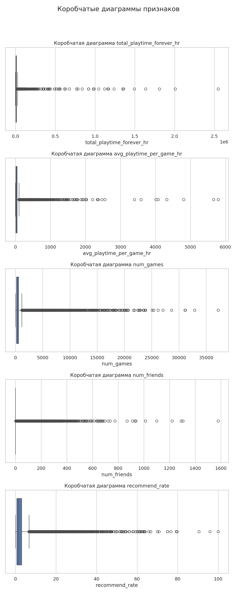
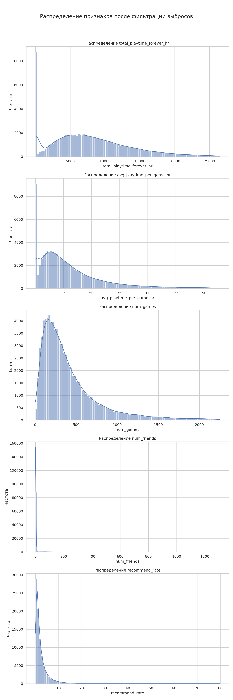
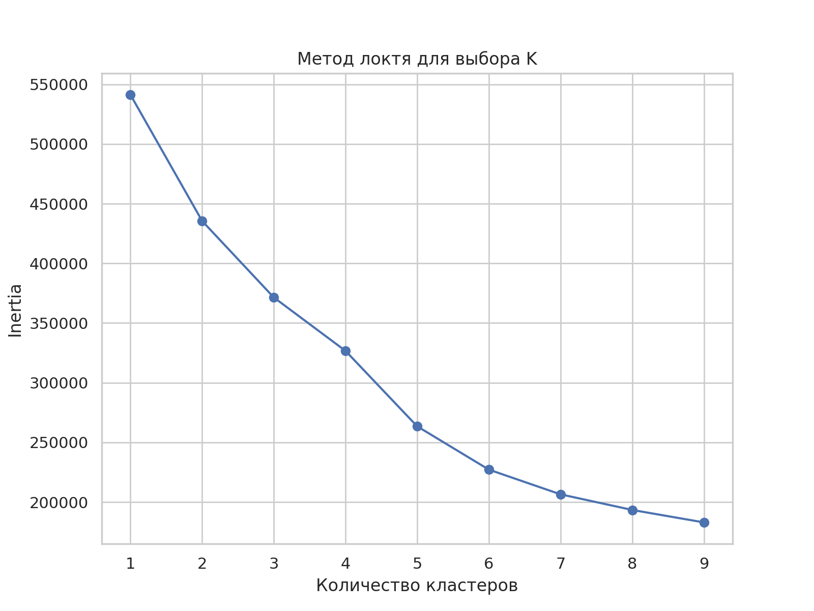
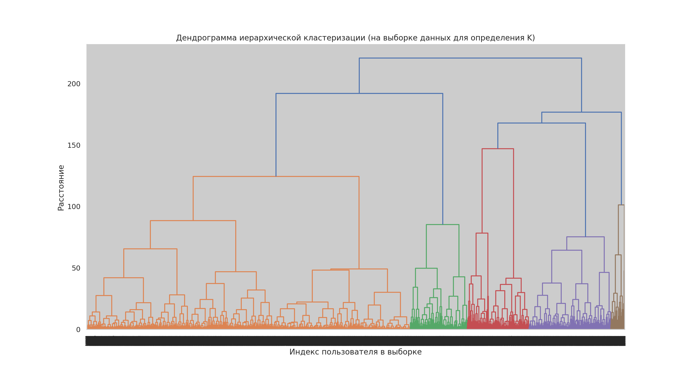
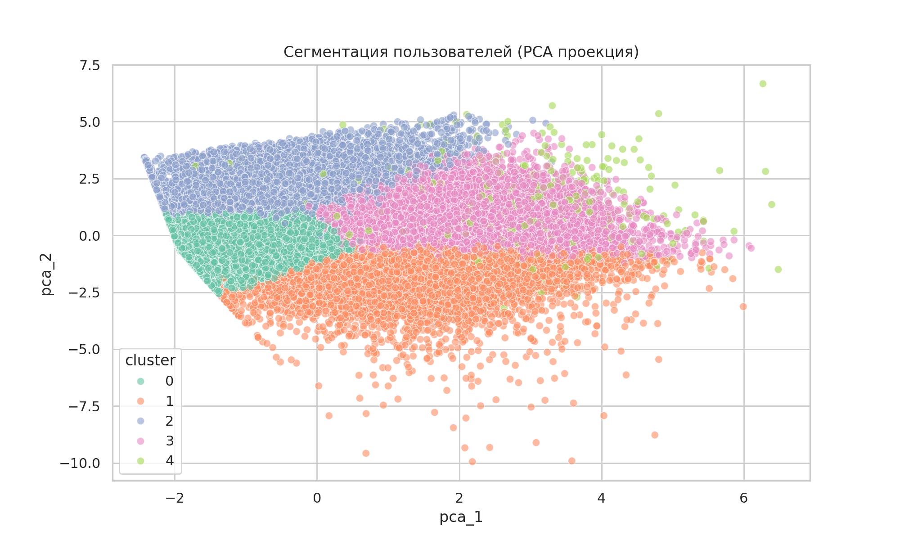
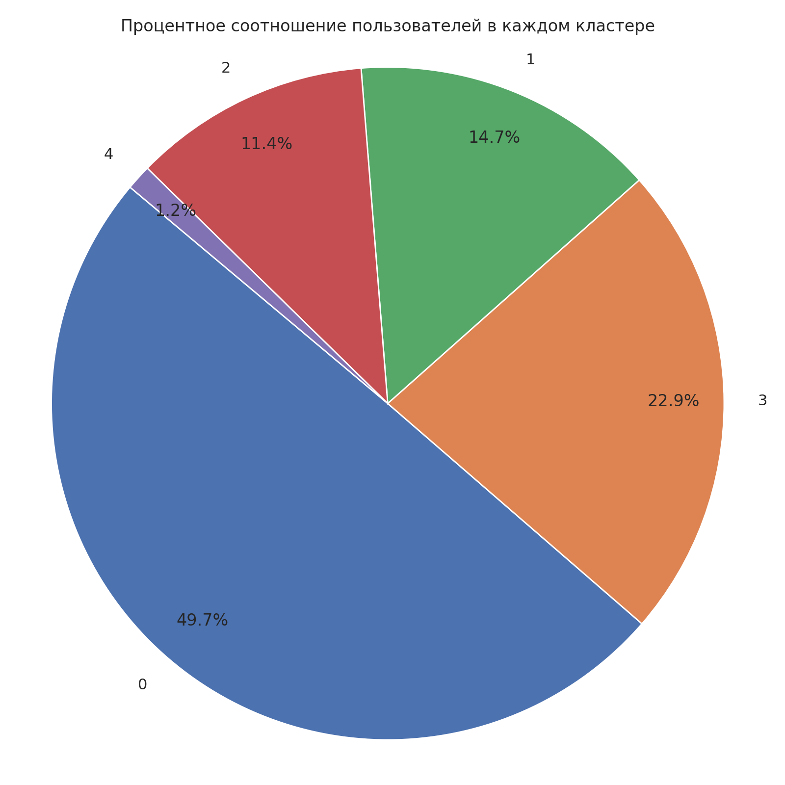
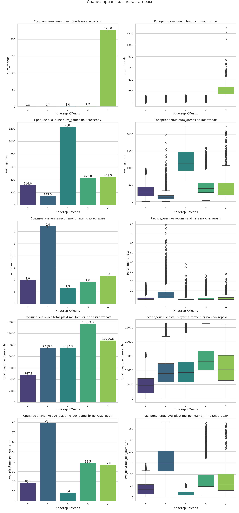

# steam_user_clustering

## Цели проекта
- Извлечь данные, выполнить очистку и провести разведочный анализ.
- Разбить пользователей на кластеры и интерпретировать поведение каждого сегмента.

**Основные задачи:**
- Извлечение данных из архива и создание датафрейма 
- Подготовка и предобработка данных
- Первичный анализ данных и визуализация
- Кластеризация пользователей
- Визуализация кластеров
- Анализ кластеров

Все артефакты сохраняются в [`images/`](images/) и [`results/`](results/).

Переход к [**Ноутбуку**](steam_user_clustering.ipynb)

---

## Используемые библиотеки
`pandas`, `numpy`, `matplotlib`, `seaborn`, `sqlite3`, `json`, `sklearn`, `scipy`, `shutil`, `datetime`, `warnings`

---

# 1) Параметры и загрузка данных
- Загружается архив данных пользователей Steam.
- Архив разархивируется.
- Выполняется подключение к базе SQLite.
- Просматривается структура таблиц и наличие необходимых колонок.

---

# 2) Извлечение данных и создание датафрейма
Из базы извлекаются **100 000 активных аккаунтов**, удовлетворяющие условиям:
- игры доступны и не пусты  
- данные в JSON корректны  

**Описание признаков:**
- `steamID` - Уникальный ID аккаунта.
- `games_used` - количество установленных игр.
- `friends_available` - Количество доступных друзей.
- `num_friends` — количество друзей  
- `num_games` — количество игр  
- `total_playtime_forever` — суммарное игровое время  
- `total_playtime_2weeks` — активность за последние 2 недели  
- `avg_playtime_per_game` — среднее время на игру  
- `recommend_rate` — % рекомендованных игр  

[Пример данных сформированного датафрейма](df_example.csv)

|         | steamID           | games_used        | friends_available | num_friends | num_games | total_playtime_forever | total_playtime_2weeks |avg_playtime_per_game | recommend_rate|
|---------|-------------------|-------------------|-------------|-----------|------------------------|-----------------------|----------------------------------------|-------------|----------|
| 0       | 76561197960265778 | 1                 | 0           | 397       | 857                    | 1474519               | 3830                                   | 1720.558926 | 0.583431 |
| 1       | 76561197960265822 | 1                 | 0           | 0         | 352                    | 769307                | 0                                      | 2185.531250 | 0.568182 |
| 2       | 76561197960265841 | 1                 | 0           | 82        | 386                    | 65461                 | 1613                                   | 169.588083  | 3.886010 |

---

# 3) Предобработка и первичный анализ данных
Выполнено:
- Проверка пропусков  
- Приведение времени из минут в часы  
- Удаление неиспользуемых столбцов  
- Обнаружение выбросов на boxplot  
- Усечение данных по **97 перцентилю**
- Проанализированные распределения признаков

Коробчатые диаграммы до обработки выбросов:

Гистограммы распределения после усечения выборки:

---

# 4) Кластеризация пользователей и визуализация кластеров

Для определение количества кластеров были использованы два метода:

**1. Метод локтя**

Показал оптимальное значение **k ≈ 5**.

**2. Дендрограмма иерархической кластеризации**

Построена на выборке **27 500 пользователей**. Подтвердила оптимальность **5 кластеров**.

Данные стандартизированы с помощью StandardScaler.

Финальное количество кластеров: **5**

Для визуализации применён PCA (2 компоненты).  

Коэффициент силуэта ≈ **0.3**, что указывает на умеренно выраженную сегментацию.

---

# 5) Анализ кластеров

Распределение пользователей

Средние значения признаков были сгруппированы по кластерам:
- `num_friends`  
- `num_games`  
- `recommend_rate`  
- `total_playtime_forever_hr`  
- `avg_playtime_per_game_hr`  

[Агрегация и анализ средних значений по каждому кластеру](df_clusters.csv)

| kmeans_cluster | num_friends        | num_games          | recommend_rate     | total_playtime_forever_hr | avg_playtime_per_game_hr |
|----------------|--------------------|--------------------|--------------------|---------------------------|--------------------------|
| 0              | 0.7604108642855552 | 314.60312827254296 | 1.9670318768413608 | 4747.946263080888         | 18.67088804932296        |
| 1              | 0.6873256427655885 | 143.45216014476364 | 6.436309564096174  | 9459.277921033452         | 79.67907937567486        |
| 2              | 1.015538506361076  | 1230.102942604642  | 1.3047831608104845 | 9512.009998057687         | 8.432504723953189        |
| 3              | 1.8753082241454335 | 428.83991683991684 | 1.8495244798512953 | 13653.347740495416        | 38.532473656701          |
| 4              | 228.04383561643834 | 441.3205479452055  | 2.349749038109718  | 10790.802267884323        | 36.9835800723776         |

Для визуализации признаков по кластерам были построены:
- столбчатые диаграммы средних значений  
- boxplot распределений  

**Интерпретация кластеров**

**Кластер 0 — Казуальные игроки (~50%)**
- Среднее число игр  
- Умеренное общее игровое время  
- Минимальная социальная активность  
- Низкий процент рекомендаций  

**Кластер 1 — Увлечённые игроки, преданные любимым играм (~15%)**
- Мало игр  
- Высокое среднее игровое время  
- Максимальный процент рекомендаций  

**Кластер 2 — Коллекционеры игр (~11%)**
- Очень много игр  
- Высокое общее игровое время  
- Низкий уровень рекомендаций  

**Кластер 3 — Старые активные игроки (~23%)**
- Среднее число игр  
- Высокое суммарное время  
- Низкая социальная активность  

**Кластер 4 — Социальные игроки / возможные продавцы (~1%)**
- Очень много друзей  
- Высокое игровое время  
- Выше среднего вовлечённость  
- Ярко отличающаяся группа  

---

# 6) Общие выводы

- Обработка данных:

   - Данные были успешно извлечены из базы SQLite, отобраны 100 000 активных аккаунтов с информацией об играх.
   - Создан DataFrame с показателями активности пользователей: количество друзей, количество игр, общее игровое время, игровое время за 2 недели, среднее игровое время на игру и процент рекомендованных игр.
   - Все временные показатели конвертированы из минут в часы для удобства анализа.
   - Проведен EDA, в ходе которого были выявлены значительные выбросы в данных. Для их обработки были применены квантили (97-й перцентиль), что позволило получить более репрезентативное распределение для кластеризации.

- Разбиение пользователей на кластеры и интерпретация:

   - Для сегментации пользователей был применен метод кластеризации K-Means.
   - Оптимальное количество кластеров, определенное с помощью метода локтя и подтвержденное анализом дендрограммы на выборке данных, составило 5.
   - Получен коэффициент силуэта около 0.3, что указывает на разумную, хотя и не идеально четкую, кластеризацию.
   - Визуализация кластеров с помощью PCA показала наличие различимых групп.

- Полученная кластеризация может использоваться как основа для построения персонализированных рекомендаций игр, оптимизации маркетинговых стратегий или анализа поведения групп пользователей.

